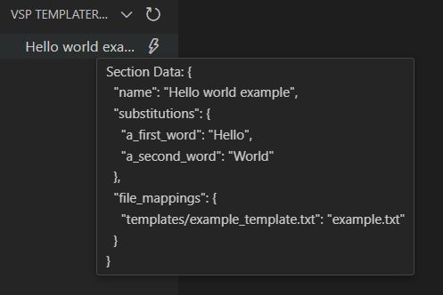

# vsp-templater 

vsp-templater is the easiest and most convenient way to manage your VS Code configuration, projects, or any other files. 


## Features

* Easily organize your templates using a TreeView template selector.
* Convenient, all-in-one YAML configuration for template descriptions.
* Straightforward and legible syntax.
* Write-it-once approach: the configuration supports section/branch inheritance.

## Extension Settings

There are no special settings in VS Code—just a single `templates.yaml` config file in your *workspace* folder.

## `templates.yaml`

The configuration supports the following keywords:

* `substitutions` - an array of key-value pairs that will be substituted in all corresponding template files.
* `file_mappings` - an array of key-value pairs for the template files to be processed.
* `name` - the display name of a section in the plugin's panel. ***If a section doesn't contain a name, it won't be displayed along with its children!*** 
* `extends` - an array of section names to be included in the current section.

A simple configuration looks like:

```yaml
hello_world:
  name: "Hello world example"
  substitutions:
  - a_first_word: "Hello"
  - a_second_word: "World"
  file_mappings:
  - "templates/example_template.txt" : "example.txt" 
```

When you apply this template, it will parse your `templates/example_template.txt` file, replace `{{{a_first_word}}}` and `{{{a_second_word}}}` with `Hello` and `World`  respectively, and write the resulting file as `example.txt` in your *workspace* folder.



## Use cases

* **Complex Projects:** For projects that span multiple platforms or architectures, you can easily manage your `.vscode/launch.json` and `CMakePresets.json` files to suit various build or debugging configurations.
* **Templates & Snippets:** Create numerous code snippets or source file templates and organize them into folders and subfolders.
* **General Use:** Anything you need!

## Tips

### Inheritance

Any section inherits all key-value pairs from its parent, so you can structure your configuration like this:

```yaml
section:
  name: Hello
  substitutions:
  - a_first_word: "Hello"
  subsection_1:
    name: World
    substitutions:
    - a_second_word: "World"
  subsection_2:
    name: "Random person"
    substitutions:
    - a_second_word: "Buddy"

```

As you can see, both subsections inherit the `a_first_word` substitution from the parent section.


### Extending

You can also extend your sections using a predefined configuration:

```yaml
.some_defaults:
  substitutions:
  - a_first_word: "Hello"
section_1:
  name: World
  extends:
  - .some_defaults
  substitutions:
  - a_second_word: "World"
section_2:
  name: "Random person"
  extends:
  - .some_defaults
  substitutions:
  - a_second_word: "Buddy"

```

In this example, instead of using inheritance, the sections extend a default configuration.


### Conclusion

Feel free to use and combine both methods to create clear and coherent configurations for your templates.

## Known Issues

I don't know.

### 1.0.0

Initial release.


**Enjoy!**
